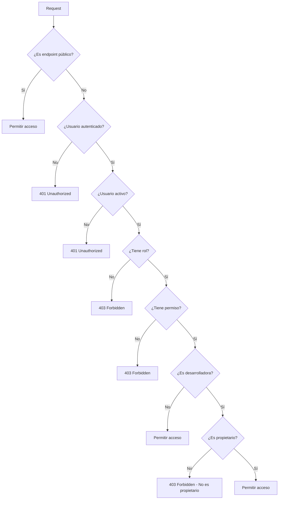

# Sistema de Roles y Permisos - API Auth Gateway v2.0.0

## Resumen

El sistema de roles personalizado implementa un control de acceso granular con 3 roles principales: `desarrolladora`, `editor`, y `superadmin`. Los endpoints GET de videojuegos son completamente públicos, mientras que el resto requiere autenticación y autorización basada en roles.

## Roles Disponibles

### 🎮 Desarrolladora
**Descripción**: Desarrolladora que puede gestionar sus propios videojuegos y desarrolladora.

**Permisos**:
- ✅ **Autenticación**: Login, logout, refresh, cambio de contraseña
- ✅ **Videojuegos**: Lectura, creación, actualización y eliminación (solo propios)
- ✅ **Desarrolladoras**: Lectura, creación, actualización y eliminación (solo propia)

**Restricciones**:
- ❌ No puede gestionar usuarios
- ❌ No puede gestionar roles
- ❌ No puede acceder a funciones administrativas

### ✏️ Editor
**Descripción**: Editor que puede gestionar todos los videojuegos y leer desarrolladoras.

**Permisos**:
- ✅ **Autenticación**: Login, logout, refresh, cambio de contraseña
- ✅ **Videojuegos**: Lectura, creación, actualización y eliminación (todos)
- ✅ **Desarrolladoras**: Solo lectura

**Restricciones**:
- ❌ No puede crear/editar/eliminar desarrolladoras
- ❌ No puede gestionar usuarios
- ❌ No puede gestionar roles
- ❌ No puede acceder a funciones administrativas

### 👑 Superadmin
**Descripción**: Superadministrador con acceso completo a todas las operaciones del sistema.

**Permisos**:
- ✅ **Autenticación**: Login, logout, refresh, cambio de contraseña
- ✅ **Usuarios**: Lectura, creación, actualización y eliminación
- ✅ **Roles**: Lectura, creación, actualización y eliminación
- ✅ **Videojuegos**: Lectura, creación, actualización y eliminación (todos)
- ✅ **Desarrolladoras**: Lectura, creación, actualización y eliminación (todas)
- ✅ **Administración**: Acceso completo a todas las funciones

## Endpoints Públicos

Los siguientes endpoints **NO requieren autenticación**:

```
GET /api/videojuegos                    # Listar videojuegos
GET /api/videojuegos/{id}               # Obtener videojuego por ID
GET /api/videojuegos/categorias/        # Listar categorías
GET /api/videojuegos/estadisticas/      # Estadísticas de videojuegos
GET /api/videojuegos/buscar/            # Buscar videojuegos
GET /auth/roles                         # Listar roles disponibles
GET /auth/roles/{role_name}/permissions # Obtener permisos de un rol
```

## Matriz de Permisos

| Endpoint | Público | Desarrolladora | Editor | Superadmin |
|----------|---------|----------------|--------|------------|
| **GET /videojuegos/\*** | ✅ | ✅ | ✅ | ✅ |
| **POST /videojuegos** | ❌ | ❌ | ✅ | ✅ |
| **PUT /videojuegos/{id}** | ❌ | ✅ (propios) | ✅ | ✅ |
| **DELETE /videojuegos/{id}** | ❌ | ✅ (propios) | ✅ | ✅ |
| **GET /desarrolladoras** | ❌ | ✅ | ✅ | ✅ |
| **POST /desarrolladoras** | ❌ | ✅ | ❌ | ✅ |
| **PUT /desarrolladoras/{id}** | ❌ | ✅ (propia) | ❌ | ✅ |
| **DELETE /desarrolladoras/{id}** | ❌ | ✅ (propia) | ❌ | ✅ |
| **GET /admin/users** | ❌ | ❌ | ❌ | ✅ |
| **POST /admin/users** | ❌ | ❌ | ❌ | ✅ |
| **PUT /admin/users/{id}** | ❌ | ❌ | ❌ | ✅ |
| **DELETE /admin/users/{id}** | ❌ | ❌ | ❌ | ✅ |
| **GET /admin/roles** | ❌ | ❌ | ❌ | ✅ |
| **POST /admin/roles** | ❌ | ❌ | ❌ | ✅ |
| **PUT /admin/roles/{id}** | ❌ | ❌ | ❌ | ✅ |
| **DELETE /admin/roles/{id}** | ❌ | ❌ | ❌ | ✅ |

## Validación de Propiedad

### Para Desarrolladoras

Las desarrolladoras solo pueden modificar/eliminar recursos que les pertenecen. La validación se realiza consultando la API Flask para verificar:

1. **Campo `owner_email`**: Debe coincidir con el email del usuario actual
2. **Campo `owner_id`**: Debe coincidir con el ID del usuario actual
3. **Campo `created_by_email`**: Alternativo para verificar propiedad
4. **Campo `created_by_id`**: Alternativo para verificar propiedad

### Ejemplo de Validación

```python
# En el endpoint PUT /videojuegos/{id}
if current_user.role.name == "desarrolladora":
    is_owner = await verify_resource_ownership(
        resource_type="videojuego",
        resource_id=videojuego_id,
        user=current_user,
        proxy_service=proxy_service
    )
    if not is_owner:
        raise HTTPException(
            status_code=403,
            detail="Solo puedes actualizar tus propios videojuegos"
        )
```

## Registro de Usuarios

### Primer Usuario
- El primer usuario registrado **automáticamente** recibe el rol `superadmin`
- Esto garantiza que siempre haya al menos un administrador en el sistema

### Usuarios Subsecuentes
- **Registro público**: Solo puede crear usuarios con roles `desarrolladora` o `editor`
- **Creación de superadmin**: Solo puede ser realizada por un superadmin existente
- **Validación**: El sistema valida que el rol solicitado sea válido

### Ejemplo de Registro

```json
POST /auth/register
{
    "email": "nuevo@desarrolladora.com",
    "password": "MiPassword123!",
    "role": "desarrolladora"
}
```

## Manejo de Errores

### Códigos de Error Específicos

| Código | Descripción | Cuándo Ocurre |
|--------|-------------|---------------|
| `INSUFFICIENT_PERMISSIONS` | Permisos insuficientes | Usuario no tiene el rol requerido |
| `NOT_RESOURCE_OWNER` | No es propietario del recurso | Desarrolladora intenta modificar recurso ajeno |
| `INVALID_ROLE` | Rol inválido | Rol no existe o no está permitido |
| `ROLE_CREATION_FORBIDDEN` | Creación de rol prohibida | Intento de crear superadmin en registro público |

### Ejemplo de Respuesta de Error

```json
{
    "success": false,
    "message": "Solo puedes actualizar tus propios videojuegos",
    "error_type": "resource_ownership_error",
    "error_code": "NOT_RESOURCE_OWNER",
    "resource_type": "videojuego",
    "resource_id": 123,
    "timestamp": "2024-01-15T10:30:00Z"
}
```

## Flujo de Autorización



## Configuración de Roles

### Inicialización Automática

Los roles se crean automáticamente al inicializar la base de datos:

```python
# En src/config/init_roles.py
async def init_default_roles():
    roles = [
        Role(name="desarrolladora", description="..."),
        Role(name="editor", description="..."),
        Role(name="superadmin", description="...")
    ]
```

### Verificación de Roles

```python
# Verificar si usuario tiene rol específico
if current_user.role.name == "desarrolladora":
    # Lógica específica para desarrolladora

# Verificar permisos
if has_permission(current_user, Permissions.VIDEOJUEGO_UPDATE):
    # Usuario tiene permiso para actualizar videojuegos
```

## Mejores Prácticas

### Para Desarrolladores

1. **Siempre verificar permisos** antes de permitir operaciones
2. **Usar las funciones helper** (`has_permission`, `verify_resource_ownership`)
3. **Implementar validación de propiedad** para desarrolladoras
4. **Manejar errores apropiadamente** con códigos específicos

### Para Administradores

1. **Crear el primer usuario** como superadmin
2. **Asignar roles apropiados** según las responsabilidades
3. **Monitorear logs** para detectar intentos de acceso no autorizado
4. **Revisar permisos regularmente** para mantener seguridad

### Para Usuarios

1. **Usar contraseñas seguras** (mínimo 8 caracteres, mayúsculas, minúsculas, números, símbolos)
2. **No compartir credenciales** con otros usuarios
3. **Reportar problemas** de acceso a los administradores
4. **Entender las limitaciones** de su rol asignado

## Migración desde Sistema Anterior

### Cambios Principales

1. **Roles eliminados**: `admin`, `user`
2. **Roles nuevos**: `desarrolladora`, `editor`, `superadmin`
3. **Endpoints públicos**: GET `/videojuegos/*` ahora son públicos
4. **Validación de propiedad**: Implementada para desarrolladoras

### Proceso de Migración

1. **Backup de base de datos** antes de la migración
2. **Ejecutar script de limpieza** para eliminar datos antiguos
3. **Inicializar nuevos roles** con `init_default_roles()`
4. **Crear usuarios de prueba** con los nuevos roles
5. **Verificar funcionalidad** de todos los endpoints

## Troubleshooting

### Problemas Comunes

**Error: "Usuario sin rol"**
- Verificar que el usuario tenga un rol asignado
- Ejecutar `init_default_roles()` si los roles no existen

**Error: "No es propietario del recurso"**
- Verificar que el campo `owner_email` o `owner_id` esté configurado en la API Flask
- Confirmar que el usuario actual sea el propietario del recurso

**Error: "Endpoint requiere autenticación"**
- Verificar que el endpoint no esté en la lista de endpoints públicos
- Confirmar que el token JWT sea válido y no haya expirado

**Error: "Rol no válido"**
- Verificar que el rol exista en la base de datos
- Confirmar que el rol esté en la lista de roles permitidos

### Logs Útiles

```bash
# Ver logs de autenticación
grep "AUTH" logs/app.log

# Ver logs de autorización
grep "PERMISSION" logs/app.log

# Ver logs de validación de propiedad
grep "OWNERSHIP" logs/app.log
```

## Contacto y Soporte

Para problemas o preguntas sobre el sistema de roles:

1. **Revisar esta documentación** primero
2. **Verificar logs** de la aplicación
3. **Contactar al equipo de desarrollo** con detalles específicos del error
4. **Proporcionar información** sobre el usuario, rol, y endpoint que causó el problema
